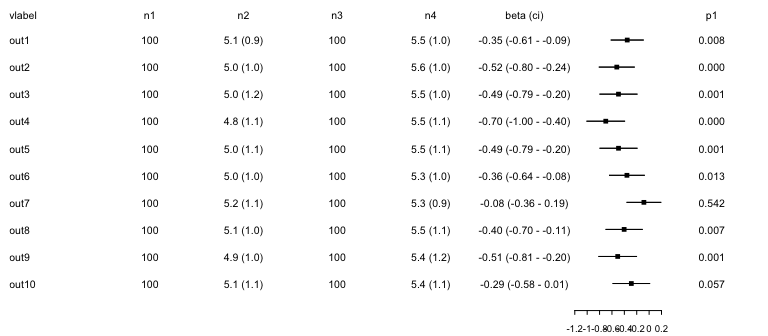
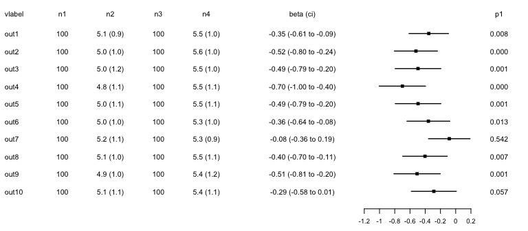
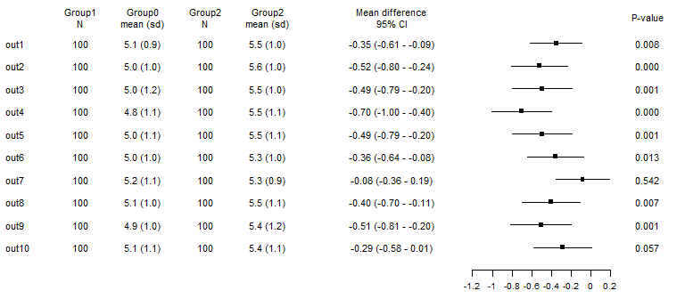
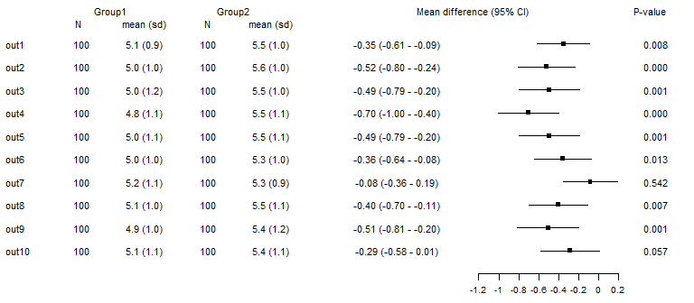
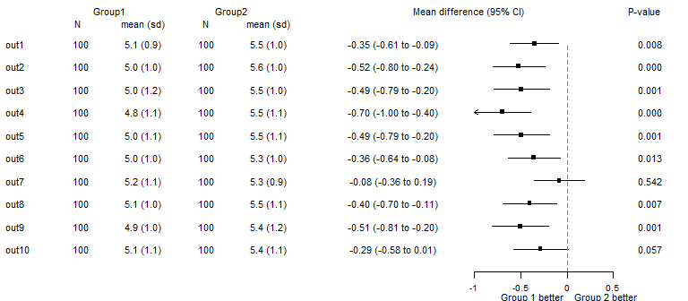
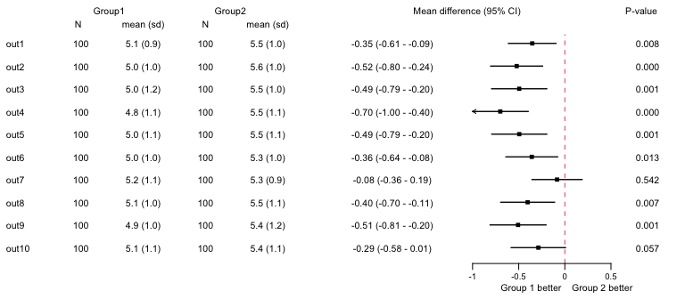
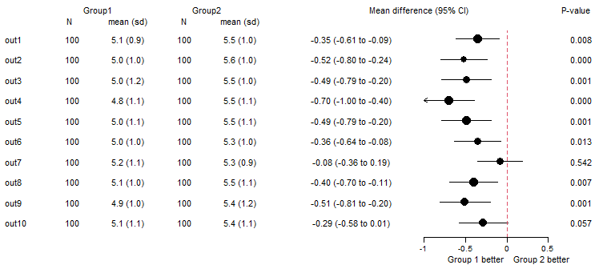
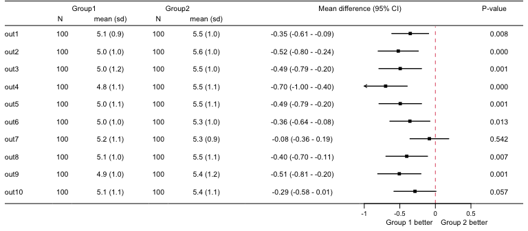
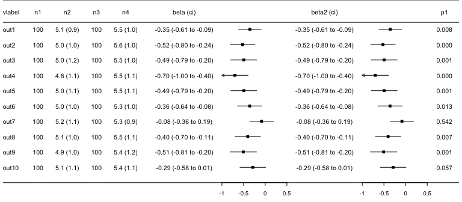

<!-- README.md is generated from README.Rmd. Please edit that file -->

# `forplot`

A package to generate forest plots.

## Installation

`forplot` can be installed from github:

``` r
# install.packages("remotes")
remotes::install_github("CTU-Bern/forplot")
```

Note that `remotes` treats any warnings (e.g. that a certain package was
built under a different version of R) as errors. If you see such an
error, run the following line and try again:

``` r
Sys.setenv(R_REMOTES_NO_ERRORS_FROM_WARNINGS = "true")
```

## Overview

`forpplot` and it’s main function fplot needs a data frame with specific
column names.

- vlabel: a chr column with the variable labels printed on the left of
  the forest plot
- nx: any number of chr or num columns numbered sequentially (i.e. n1,
  n2, n3, …). Printed in that seqence after the column label. May
  contain the number of observations and/or summary per group.
- beta, beta_lci, beta_uci: three num columns with point estimates and
  confidence interval to be plotted as forest.
- beta_format: optional chr column with formatted text to be prin§ted
  along forest, generated from beta if not given.
- px: any number of chr or num columns numbered sequentially (i.e. p1,
  p2, p3, …), printed on the very right of the plot. May contain
  p-values.

The package includes an example dataset with 10 variables:

``` r
# load package
library(forplot)

# demonstration data
data(forplotdata)

forplotdata
#>    vlabel  n1        n2  n3        n4        beta   beta_lci     beta_uci    p1
#> 1    out1 100 5.1 (0.9) 100 5.5 (1.0) -0.35330456 -0.6122615 -0.094347655 0.008
#> 2    out2 100 5.0 (1.0) 100 5.6 (1.0) -0.52192832 -0.8044964 -0.239360217 0.000
#> 3    out3 100 5.0 (1.2) 100 5.5 (1.0) -0.49461488 -0.7938491 -0.195380711 0.001
#> 4    out4 100 4.8 (1.1) 100 5.5 (1.1) -0.69983471 -1.0035691 -0.396100319 0.000
#> 5    out5 100 5.0 (1.1) 100 5.5 (1.1) -0.49398774 -0.7928756 -0.195099871 0.001
#> 6    out6 100 5.0 (1.0) 100 5.3 (1.0) -0.35838850 -0.6395674 -0.077209590 0.013
#> 7    out7 100 5.2 (1.1) 100 5.3 (0.9) -0.08429217 -0.3567376  0.188153237 0.542
#> 8    out8 100 5.1 (1.0) 100 5.5 (1.1) -0.40311974 -0.6955442 -0.110695309 0.007
#> 9    out9 100 4.9 (1.0) 100 5.4 (1.2) -0.50709366 -0.8110643 -0.203123036 0.001
#> 10  out10 100 5.1 (1.1) 100 5.4 (1.1) -0.28700316 -0.5822050  0.008198722 0.057
```

The nx columns included the number of observations and descritpives
(mean (sd)) for each group, beta is a mean difference, p1 the p-value.

The minimal plot only includes a label and the forest and needs columns
vlabel, beta, beta_lci, beta_uci.

``` r
fplot(dat=forplotdata[,c("vlabel","beta","beta_lci","beta_uci")])
```

<!-- -->

We can add the nx and px columns:

``` r
fplot(dat=forplotdata)
```

<!-- -->

Set more sensible widths and heights. The widths has to be the same
length as the number of columns for the input data plus two for the left
and right margin. The length is usually three, header, body and footer.

``` r
lwidths<-c(0.05,0.5,0.2,0.8,0.2,0.8,1.2,1.2,0.5,0.05)

lheights<-c(0.14,1,0.08)

fplot(dat=forplotdata,lwidths=lwidths,lheights=lheights)
```

<!-- -->

A header can be given using a character vector the same length as the
number of columns of the input data, which then places it above the
columns

``` r
header<-c("","Group1\nN","Group0\nmean (sd)","Group2\nN","Group2\nmean (sd)",
    "Mean difference\n95% CI","","P-value")

fplot(dat=forplotdata,lwidths=lwidths,lheights=lheights,header=header)
```

<!-- -->

The header can also be placed at any x/y position using a list with one
element per header line.

``` r
header<-list(list(y=0.7,
    text=c("Group1","Group2","Mean difference (95% CI)","P-value"),
    x=c(0.10,0.32,0.7,0.98)),
    list(y=0.3,text=c("N","mean (sd)","N","mean (sd)"),
    x=c(0.07,0.18,0.28,0.38)))

fplot(dat=forplotdata,header=header,lwidths=lwidths,lheights=lheights)
```

<!-- -->

A label can be placed below the x-axis using option xtitle. Option ref
adds a vertical reference line and xlim specifies the limits for the
axis.

``` r
xtitle<-list(x=0.86,y=0.2,textl="Group 1 better  ",textr="  Group 2 better")

fplot(dat=forplotdata,header=header,lwidths=lwidths,lheights=lheights,
    xtitle=xtitle,ref=list(x=0),xlim=c(-1,0.5))
```

<!-- -->

Note that arrows are shown if the limits of the CIs are not included
within xlim.

There are further options for the reference line and we can shift the
x-axis if the gap at the bottom is too large.

``` r
xtitle<-list(x=0.86,y=0.6,textl="Group 1 better  ",textr="  Group 2 better")

fplot(dat=forplotdata,header=header,lwidths=lwidths,lheights=lheights,
    ref=list(x=0,col=2,extend=2),
    xtitle=xtitle,xlim=c(-1,0.5),shift_xaxis=0.3,xlab_line=-0.8)
```

<!-- -->

The points of the forest plots can also be formatted.

``` r
ps<-list(pch=16,cex=rnorm(10,2,0.2),col=1)

fplot(dat=forplotdata,header=header,lwidths=lwidths,lheights=lheights,
    ref=list(x=0,col=2,extend=2),
    xtitle=xtitle,xlim=c(-1,0.5),shift_xaxis=0.3,xlab_line=-0.8,
    ps=ps)
```

<!-- -->

Lines at the top and bottom can be added.

``` r
fplot(dat=forplotdata,header=header,lwidths=lwidths,lheights=lheights,
  ref=list(x=0,col=2,extend=2),
    xtitle=xtitle,xlim=c(-1,0.5),shift_xaxis=0.3,xlab_line=-0.8,
    headline=2,bottomline=1)
```

<!-- -->

If effect measures are on the log-scale (e.g. for odds ratios), option
lscale can be used to indicate that the text should contain the
exponentiated values. Axis ticks and labels have to be adapted by hand.

``` r

xlab_text<-c(0.3,0.5,0.8,1.0,1.5)
xlab<-log(xlab_text)
xlim<-log(c(min(xlab_text),max(xlab_text)))

fplot(dat=forplotdata,header=header,lwidths=lwidths,lheights=lheights,
  ref=list(x=0,col=2,extend=2),
  lscale=TRUE,
    xtitle=xtitle,shift_xaxis=0.3,xlab_line=-0.8,
  xlim=xlim,xlab=xlab, xlab_text=xlab_text,
    headline=2,bottomline=1)
```

<!-- -->

## Under development

A feature under development is adding a second forest plot (e.g. to show
a risk difference and ratio). That needs a beta, beta_lci2 and beta_uci2
column in the dataset (just copied over in the example below). Options
xlab2,xlab_text2,xlim2 and xtitle2 are available to format the second
plot.

``` r

forplotdata2<-forplotdata
forplotdata2$beta2<-forplotdata2$beta
forplotdata2$beta_lci2<-forplotdata2$beta_lci
forplotdata2$beta_uci2<-forplotdata2$beta_uci
forplotdata2<-forplotdata2[,colnames(forplotdata2) != "p1"]
forplotdata2$p1<-forplotdata$p1
  
lwidths<-c(0.05,0.5,0.2,0.8,0.2,0.8,1.2,1.2,1.2,1.2,0.5,0.05)
lheights<-c(0.14,1,0.08)

fplot(dat=forplotdata2,beta2 = TRUE,
      lwidths=lwidths,lheights=lheights,
      xlim=c(-1,0.5),xlim2=c(-1,0.5),
      headline=2,bottomline=1)
```

<!-- -->
