<!-- README.md is generated from README.Rmd. Please edit that file -->

# `forplot`

A package to generate forest plots.

## Installation

`forplot` can be installed from github:

``` r

#install package using remotes
remotes::install_github("dcr-unibe-ch/forplot")

# load package
library(forplot)
```

## Usage

`forplot` contains two main functions to build a forest plot.

`genfobj` requires a *layout*, specifying the elements to be plotted and
a data frame (*dat*) with the data to be plotted and produces a list of
class **fobj**.

The **fobj** can then be modified using a series of helper functions or
directly by changing the list.

`plotfobj` then produces the forest plot from the **fobj**

## Example data

The package includes two example data sets, one with continuous
(*forplotdata*) and one with binary variables (*forplotdata_prop*).

``` r

data(forplotdata)
forplotdata
#>    vlabel  n1        n2  n3        n4            beta_format        beta
#> 1    out1 100 5.1 (0.9) 100 5.5 (1.0) -0.35 (-0.61 to -0.09) -0.35330456
#> 2    out2 100 5.0 (1.0) 100 5.6 (1.0) -0.52 (-0.80 to -0.24) -0.52192832
#> 3    out3 100 5.0 (1.2) 100 5.5 (1.0) -0.49 (-0.79 to -0.20) -0.49461488
#> 4    out4 100 4.8 (1.1) 100 5.5 (1.1) -0.70 (-1.00 to -0.40) -0.69983471
#> 5    out5 100 5.0 (1.1) 100 5.5 (1.1) -0.49 (-0.79 to -0.20) -0.49398774
#> 6    out6 100 5.0 (1.0) 100 5.3 (1.0) -0.36 (-0.64 to -0.08) -0.35838850
#> 7    out7 100 5.2 (1.1) 100 5.3 (0.9)  -0.08 (-0.36 to 0.19) -0.08429217
#> 8    out8 100 5.1 (1.0) 100 5.5 (1.1) -0.40 (-0.70 to -0.11) -0.40311974
#> 9    out9 100 4.9 (1.0) 100 5.4 (1.2) -0.51 (-0.81 to -0.20) -0.50709366
#> 10  out10 100 5.1 (1.1) 100 5.4 (1.1)  -0.29 (-0.58 to 0.01) -0.28700316
#>      beta_lci     beta_uci    p1
#> 1  -0.6122615 -0.094347655 0.008
#> 2  -0.8044964 -0.239360217 0.000
#> 3  -0.7938491 -0.195380711 0.001
#> 4  -1.0035691 -0.396100319 0.000
#> 5  -0.7928756 -0.195099871 0.001
#> 6  -0.6395674 -0.077209590 0.013
#> 7  -0.3567376  0.188153237 0.542
#> 8  -0.6955442 -0.110695309 0.007
#> 9  -0.8110643 -0.203123036 0.001
#> 10 -0.5822050  0.008198722 0.057
```

``` r
data(forplotdata)
forplotdata_prop
#>    vlabel  n1       n2  n3       n4 prop1 prop2            beta_format  beta
#> 1    out1 100 48 (48%) 100 40 (40%)  0.48  0.40   8.0% (-6.7 to 22.7%)  0.08
#> 2    out2 100 38 (38%) 100 37 (37%)  0.38  0.37  1.0% (-13.4 to 15.4%)  0.01
#> 3    out3 100 47 (47%) 100 47 (47%)  0.47  0.47  0.0% (-13.8 to 13.8%)  0.00
#> 4    out4 100 54 (54%) 100 41 (41%)  0.54  0.41  13.0% (-1.7 to 27.7%)  0.13
#> 5    out5 100 45 (45%) 100 40 (40%)  0.45  0.40   5.0% (-9.7 to 19.7%)  0.05
#> 6    out6 100 51 (51%) 100 38 (38%)  0.51  0.38  13.0% (-1.7 to 27.7%)  0.13
#> 7    out7 100 47 (47%) 100 36 (36%)  0.47  0.36  11.0% (-3.6 to 25.6%)  0.11
#> 8    out8 100 44 (44%) 100 46 (46%)  0.44  0.46 -2.0% (-16.8 to 12.8%) -0.02
#> 9    out9 100 53 (53%) 100 33 (33%)  0.53  0.33   20.0% (5.6 to 34.4%)  0.20
#> 10  out10 100 54 (54%) 100 38 (38%)  0.54  0.38   16.0% (1.4 to 30.6%)  0.16
#>       beta_lci  beta_uci    p1
#> 1  -0.06714147 0.2271415 0.319
#> 2  -0.13418240 0.1541824 1.000
#> 3  -0.13834069 0.1383407 1.000
#> 4  -0.01723947 0.2772395 0.089
#> 5  -0.09684704 0.1968470 0.567
#> 6  -0.01656604 0.2765660 0.088
#> 7  -0.03571955 0.2557195 0.151
#> 8  -0.16786783 0.1278678 0.887
#> 9   0.05560305 0.3443969 0.007
#> 10  0.01364509 0.3063549 0.033
```

There are text columns *n\[1-4\]* with the number of observations and
descriptives for each arm (either mean (sd) or n(%)), the fomratted
treatment effect (*beta_format*) and the p-value (*p1*), and three
numeric columns with to draw the forest (*beta*, *beta_lci* and
*beta_uci*).

In the *forplotdata_prop* there are two further numeric columns with the
proportion in each arm (*prop1*, *prop2*) to draw a srip plot.

## Generating the **fobj** with `genfobj`

`genfobj` requires the input of a *layout* and a data frame *dat*.

*layout* must be a character vector with elements *t* (text), *f*
(forest), *s\[1-9\]* (strip), or *b* (boxplot).

For each *t* element, *dat* must contain a single column, for each *f*
element three columns (point estimate, lower confidence limit, upper
confidence limit, in that order), and for each *s\[1-9\]* the number of
columns indicated in \[\].

The order of the columns must correspond to the layout.

A *b* element does not need a column in *dat* but the specifcation of
*bpdat*, a data frame in a long format with columns *out* (the outcome
value), *var* (the outcome variable, safest as a factor to preserve the
order in the plot), and *arm* (the treatment arm, safest as a factor to
preserve the order in the plot)

We want to use *forplotdata* and generate a plot with a text columns
with the label, the descriptives, the formatted effect and the p-value,
and a forest for the beta.

``` r
fobj<-genfobj(dat = forplotdata, layout = c("t","t","t","t","t","t","f","t"))
```

The produced **fobj** is a list of length 5 with class *fobj*. It
includes those elements:

- *dat* and *bpdat*: the data
- *setup*: the options from `genfobj` which has been given or assumed by
  default (i.e. *layout*, *lheights*, *lwidths*, *y.at*, *ylim*)
- *items*: a list of length from *layout* with the options for each item
- *header*: a list with the options for the header

``` r
class(fobj)
#> [1] "fobj" "list"
names(fobj)
#> [1] "dat"    "bpdat"  "setup"  "items"  "header"
fobj$setup
#> $layout
#> [1] "t" "t" "t" "t" "t" "t" "f" "t"
#> 
#> $lwidths
#> [1] 1 1 1 1 1 1 1 1
#> 
#> $lheights
#> [1] 0.1 1.0 0.1
#> 
#> $y.at
#>  [1]  1  2  3  4  5  6  7  8  9 10
#> 
#> $ylim
#> [1]  0.55 10.45
length(fobj$items)
#> [1] 8
```

By default, text items include these options:

``` r
names(fobj$item[[1]])
#> [1] "type"  "vname" "plot"  "text"

fobj$item[[1]]
#> $type
#> [1] "t"
#> 
#> $vname
#> [1] "vlabel"
#> 
#> $plot
#> $plot$x
#> [1] 0
#> 
#> $plot$type
#> [1] "n"
#> 
#> $plot$xlim
#> [1] 0 1
#> 
#> $plot$ylim
#> [1]  0.55 10.45
#> 
#> $plot$yaxt
#> [1] "n"
#> 
#> $plot$ylab
#> [1] ""
#> 
#> $plot$xlab
#> [1] ""
#> 
#> $plot$axes
#> [1] FALSE
#> 
#> $plot$xaxs
#> [1] "i"
#> 
#> $plot$yaxs
#> [1] "i"
#> 
#> 
#> $text
#> $text$x
#> [1] 0.5
#> 
#> $text$y
#>  [1]  1  2  3  4  5  6  7  8  9 10
#> 
#> $text$labels
#>  [1] "out1"  "out2"  "out3"  "out4"  "out5"  "out6"  "out7"  "out8"  "out9" 
#> [10] "out10"
#> 
#> $text$adj
#> [1] 0.5 0.5
```

*type* is the item type, *vname* is the variable in *dat* the item
corresponds to, *plot* and *text* are the options used for plotting with
base r.

The *f* items are more complex, including options for *axis*, *points*
and *arrows* of the fores plots.

``` r
names(fobj$items[[which(fobj$setup$layout=="f")]])
#> [1] "type"   "vname"  "plot"   "axis"   "points" "arrows"

fobj$items[[which(fobj$setup$layout=="f")]]$type
#> [1] "f"

fobj$items[[which(fobj$setup$layout=="f")]]$vname
#> [1] "beta"
```

For the variable name, the first of the three variables used to specify
the forest is used. Options for axis, point and arrows can be changed
using helper functions (or directly in the list). Examples or shown
below.

## Plot the **fobj**

The **fobj** can be plotted using `plotfobj`

``` r
plotfobj(fobj)
```

<!-- -->

And with a bit nicer widths, which can be given as options in `genfobj`
or just be changing the **fobj**:

``` r
fobj$setup$lwidths <- c(0.8,0.4,0.6,0.4,0.6,1,1,0.5)

plotfobj(fobj)
```

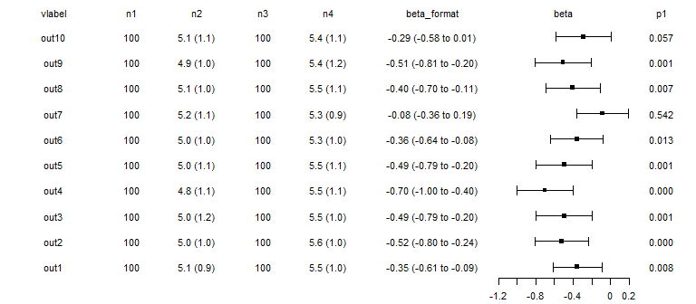<!-- -->

Gridlines and stripes can be added with helper functions *gridlines* and
*stripes*, which generate further elements in the fobj:

``` r
fobj<-gridlines(fobj)

fobj<-stripes(fobj)

names(fobj)
#> [1] "dat"       "bpdat"     "setup"     "items"     "header"    "gridlines"
#> [7] "stripes"
```

``` r
plotfobj(fobj)
```

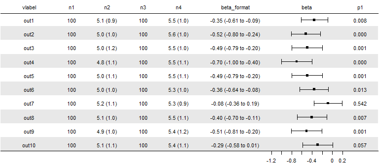<!-- -->

## Modify the items

All items, gridlines and stripes can be modified using helper functions
or within the list directly.

For *t* items helper function *t_options* allows to use all options used
in R `?graphics::text` function. That can be done for a specific t item
by using the number or column name of the item, or for all (by keeping
item=NULL):

``` r
fobj<-t_options(fobj = fobj, item = c("vlabel"), cex = 1.2, font = 2, col = "red")

plotfobj(fobj)
```

<!-- -->

For *f* items there are several helper function to modify the options
for the different elements: *f_axis*, *f_points*, *f_arrows*. Also here,
all options from `?graphics::axis`, `?graphics::points` and
`?graphics::arrows` can be used. As we do only have one forest item, we
do not have specify the *item*.

``` r
fobj<-f_axis(fobj = fobj, at = seq(-1,0.2, by=0.4), labels = seq(-1,0.2, by=0.4), 
  tck = -0.03, mgp = c(2,0.5,0))

fobj<-f_points(fobj = fobj, pch = 16, cex = 1.5)

plotfobj(fobj)
```

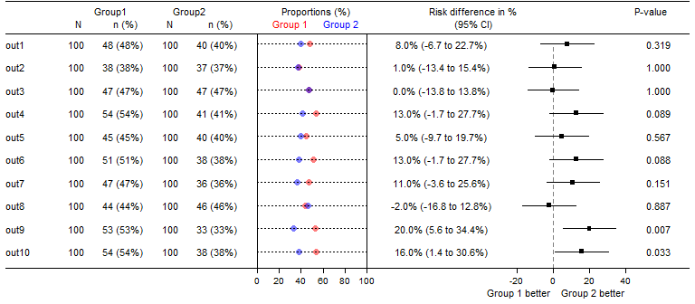<!-- -->

With *f_refline*, a reference line can be added and with *f_direction* a
label for the direction below the axis. Note that the footer height has
to be increased to fit the direction label.

``` r
fobj<-f_refline(fobj, x = c(0, 0))

fobj<-f_direction(fobj, text = "A better    B better", line = 1.6)

fobj$setup$lheights[3]<-0.15

plotfobj(fobj)
```

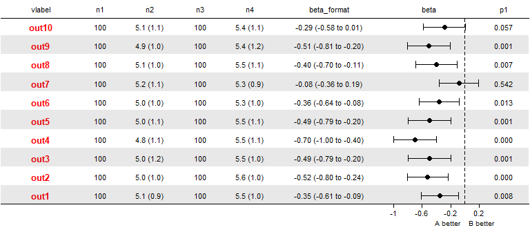<!-- -->

To remove an added item, it can be set to NULL (or a new **fobj** could
be generated):

``` r
fobj$items[[which(fobj$setup$layout=="f")]]$refline<-NULL

plotfobj(fobj)
```

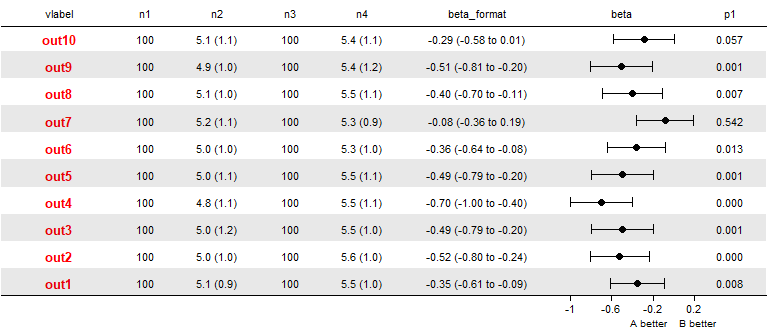<!-- -->

## The header

By default a header with the columns names is used and stored in the
*header* element of **fobj**, which is a list of length 1 with these
elements.

``` r
fobj$header
#> [[1]]
#> [[1]]$hlayout
#> [1] 1 2 3 4 5 6 7 8
#> 
#> [[1]]$text
#> [[1]]$text$x
#> NULL
#> 
#> [[1]]$text$y
#> [1] 0.5
#> 
#> [[1]]$text$labels
#> [1] "vlabel"      "n1"          "n2"          "n3"          "n4"         
#> [6] "beta_format" "beta"        "p1"         
#> 
#> [[1]]$text$adj
#> [1] 0.5 0.5
```

The *header* function can be used to modify the options using all
options from `?graphics::text`. As an extra element, the *hlayout* can
be used to merge columns, i.e. to print a label over more than one
column. And more than one header row can be specified using *headernr*,
leading to a list of length \> 1.

Let’s first just use different names, also including a line separator.
Note that an empty character has to be included to leave column 1 and 8
empty. And the y is also modified to place the label it a bit higher.

``` r

fobj<-header(fobj = fobj,
  labels = c("","Arm A\nN","Arm A\nmean (sd)","Arm B\nN","Arm B\nmean (sd)",
    "Mean difference\n95% CI","","P-value"),
  y = 0.6)

plotfobj(fobj)
```

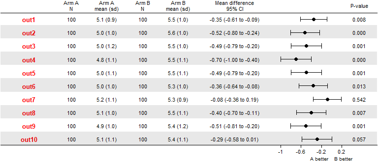<!-- -->

We could also merge the label for the effect over the format and forest
columns. We would then change the layout to include one label twice. And
remove the empty label for the forest column.

``` r

fobj<-header(fobj = fobj, hlayout = c(1,2,3,4,5,6,6,7),
  labels = c("","Arm A\nN","Arm A\nmean (sd)","Arm B\nN","Arm B\nmean (sd)",
    "Mean difference 95% CI","P-value"))

plotfobj(fobj)
```

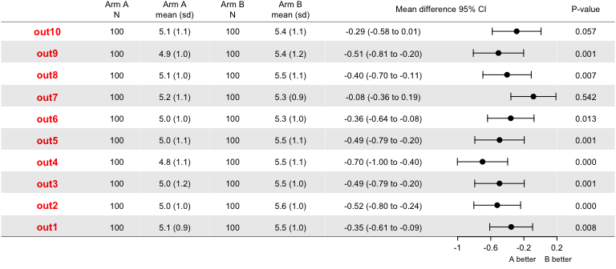<!-- -->

In order to also merge to arm labels, we would need to header rows using
option *headernr*, leading to a header list with length 2: As before we
can use further `?graphics::text` options.

``` r

fobj<-header(fobj=fobj, hlayout = c(1,2,2,3,3,4,4,5),  headernr = 1,
    labels=c("","Arm A","Arm B","Mean diff (95% CI)","P-value"),
    y=0.9)

fobj<-header(fobj=fobj, hlayout = c(1,2,3,4,5,6,7,8), headernr = 2,
    labels=c("","N","Mean (sd)","N","Mean (sd)","","",""),y=0.3)


fobj$header 
#> [[1]]
#> [[1]]$hlayout
#> [1] 1 2 2 3 3 4 4 5
#> 
#> [[1]]$text
#> [[1]]$text$x
#> NULL
#> 
#> [[1]]$text$y
#> [1] 0.9
#> 
#> [[1]]$text$labels
#> [1] ""                   "Arm A"              "Arm B"             
#> [4] "Mean diff (95% CI)" "P-value"           
#> 
#> [[1]]$text$adj
#> [1] 0.5 0.5
#> 
#> 
#> 
#> [[2]]
#> [[2]]$hlayout
#> [1] 1 2 3 4 5 6 7 8
#> 
#> [[2]]$text
#> [[2]]$text$x
#> NULL
#> 
#> [[2]]$text$y
#> [1] 0.3
#> 
#> [[2]]$text$labels
#> [1] ""          "N"         "Mean (sd)" "N"         "Mean (sd)" ""         
#> [7] ""          ""         
#> 
#> [[2]]$text$adj
#> [1] 0.5 0.5
```

``` r

plotfobj(fobj)
```

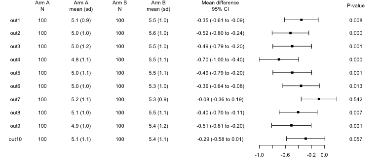<!-- -->

## Boxplots

For a more in-depth presentation of the raw data in each group, a
boxplot can be added. It depends on the input of the raw data as a data
frame in a long format with columns:

- *out*: the outcome value (numerical),
- *var*: the outcome variable, safest as a factor to preserve the order
  in the plot, and
- *arm*: the treatment arm, safest as a factor to preserve the order in
  the plot.

Boxplot layout can be controled via helper functions *b_boxplot* and
*b_axis* using all options available for `?graphics::boxplot` and
`?graphics::axis`.

``` r

fobj<-genfobj(dat = forplotdata, bpdat = forplotdata_bp,
  layout = c("t","t","t","t","t","b","t","f","t"),
  lwidths = c(0.6,0.4,0.6,0.4,0.6,1,1,1,0.5))

plotfobj(fobj)
```

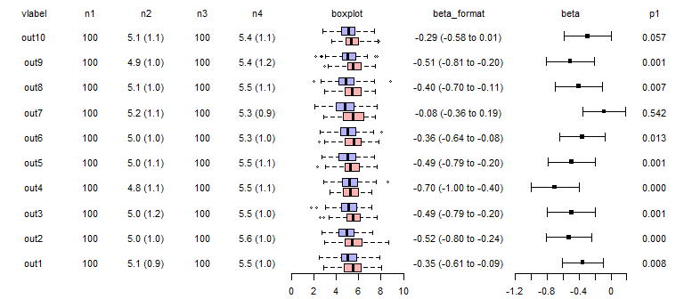<!-- -->

Adding header gridlines and stripes:

``` r

fobj<-gridlines(fobj)

fobj<-stripes(fobj)

fobj<-header(fobj=fobj, hlayout = c(1,2,2,3,3,4,5,5,6),  headernr = 1,
    labels=c("","Arm A","Arm B","","Mean diff (95% CI)","P-value"),
    col = c(1,"red","blue",1,1),
    y=0.9)
fobj<-header(fobj=fobj, hlayout = c(1,2,3,4,5,6,7,8,9), headernr = 2,
    labels=c("","N","Mean (sd)","N","Mean (sd)","","","",""),y=0.3)

plotfobj(fobj)
```

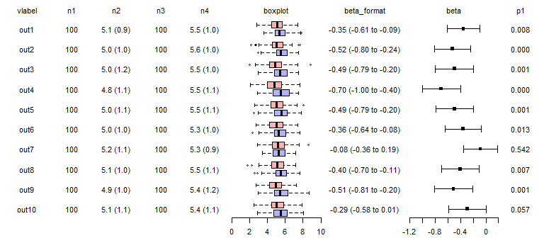<!-- -->

## Strip plot for proportions

For binary outcomes and in particular for serious adverse event
reporting a graphical representation of the proportion in both arms has
been recommended.

A strip plot for the proportions can be added via *s\[1-9\]*, where the
number would indicate the number of points in the strip plot and the
number of columns in the *dat* (usually two if there are two treatment
arms). The “s” items then contains several *points* elements.

For example:

``` r

fobj<-genfobj(dat = forplotdata_prop,
  layout = c("t","t","t","t","t","s2","t","f","t"),
  lwidths = c(0.6,0.4,0.6,0.4,0.6,1.0,1.2,1,0.5))

plotfobj(fobj)
```

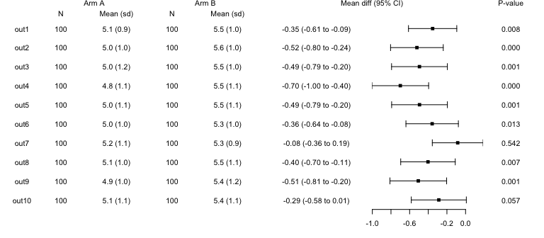<!-- -->

Options can be modified via *s_axis*, *s_hline* and *s_points* using all
options available for using all options available for `?graphics::axis`,
`?graphics::abline` and `?graphics::points`.

Note that for points, each sub-item has can be specified separately
using *pointnr* (e.g. to specify colors).

Left and right borders can be added via *s_borders*.

``` r

fobj<-s_axis(fobj=fobj, xlim = c(0,1), 
  at = seq(0,1,by=0.25), labels = seq(0,100,by=25))

fobj<-s_points(fobj=fobj, pch = 16, cex=1.5)

fobj<-s_points(fobj=fobj, pointnr = 1, col = "red")

fobj<-s_points(fobj=fobj, pointnr = 2, col = "blue")

fobj<-s_borders(fobj)

fobj<-gridlines(fobj)

plotfobj(fobj)
```

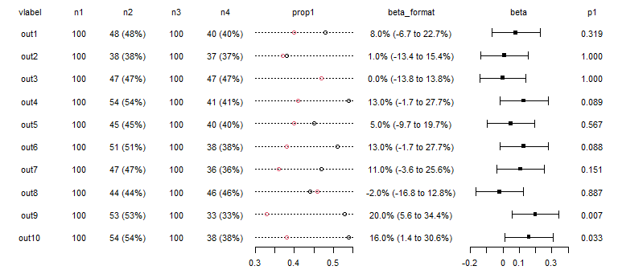<!-- -->
