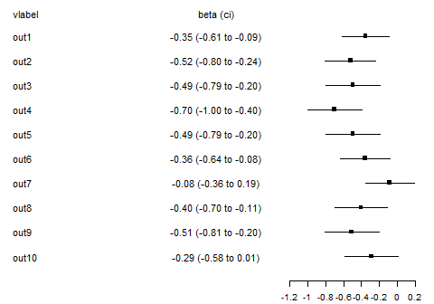
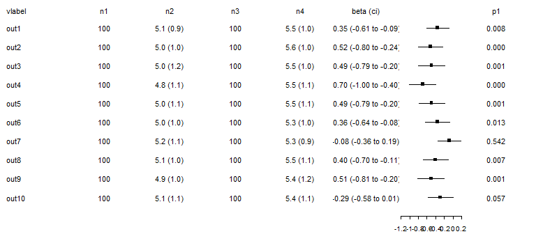
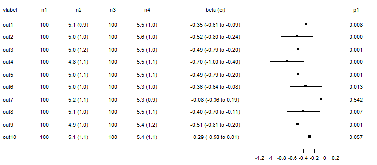
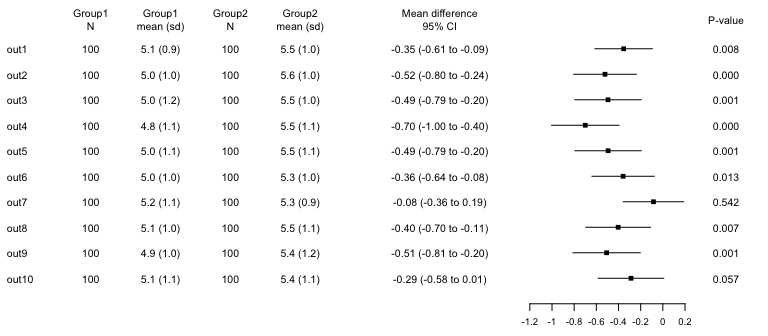
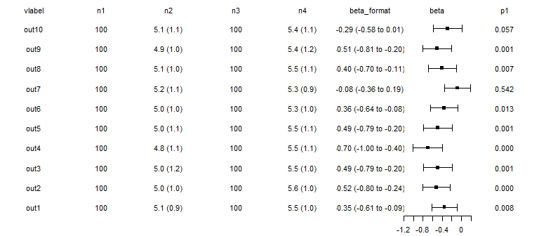
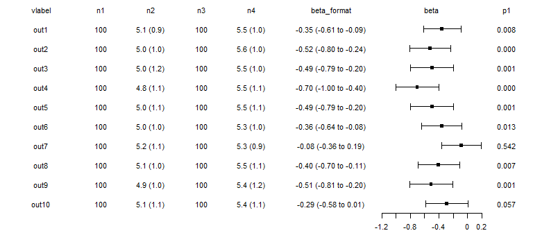

<!-- README.md is generated from README.Rmd. Please edit that file -->

# `forplot`

A package to generate forest plots.

## Installation

`forplot` can be installed from github:

``` r
# install.packages("remotes")
remotes::install_github("dcr-unibe-ch/forplot")
```

## Usage

`forplot` and its main function `fplot` needs a data frame with specific
column names.

- *vlabel*: a *chr* column with the variable labels.
- *nx*: any number of *chr* or *num* columns numbered sequentially
  (i.e. *n1*, *n2*, *n3*, …). Could contain the number of observations
  and/or summary per group.
- *beta*, *beta_lci*, *beta_uci*: three *num* columns with point
  estimates and confidence interval to be plotted as forest.
- *beta_format*: optional *chr* column with formatted text to be printed
  along forest, generated from betas if not given.
- *px*: any number of *chr* or *num* columns numbered sequentially
  (i.e. *p1*, *p2*, *p3*, …). Could contain p-values.

The order of the columns is kept for the plot.

The package includes an example dataset with 10 variables:

``` r
# load package
library(forplot)

# demonstration data
data(forplotdata)

forplotdata
#>    vlabel  n1        n2  n3        n4        beta   beta_lci     beta_uci    p1
#> 1    out1 100 5.1 (0.9) 100 5.5 (1.0) -0.35330456 -0.6122615 -0.094347655 0.008
#> 2    out2 100 5.0 (1.0) 100 5.6 (1.0) -0.52192832 -0.8044964 -0.239360217 0.000
#> 3    out3 100 5.0 (1.2) 100 5.5 (1.0) -0.49461488 -0.7938491 -0.195380711 0.001
#> 4    out4 100 4.8 (1.1) 100 5.5 (1.1) -0.69983471 -1.0035691 -0.396100319 0.000
#> 5    out5 100 5.0 (1.1) 100 5.5 (1.1) -0.49398774 -0.7928756 -0.195099871 0.001
#> 6    out6 100 5.0 (1.0) 100 5.3 (1.0) -0.35838850 -0.6395674 -0.077209590 0.013
#> 7    out7 100 5.2 (1.1) 100 5.3 (0.9) -0.08429217 -0.3567376  0.188153237 0.542
#> 8    out8 100 5.1 (1.0) 100 5.5 (1.1) -0.40311974 -0.6955442 -0.110695309 0.007
#> 9    out9 100 4.9 (1.0) 100 5.4 (1.2) -0.50709366 -0.8110643 -0.203123036 0.001
#> 10  out10 100 5.1 (1.1) 100 5.4 (1.1) -0.28700316 -0.5822050  0.008198722 0.057
```

The *nx* columns include the number of observations and descriptives
(mean (sd)) for each group, *beta* is a mean difference, *p1* the
p-value.

The minimal plot only includes a label and the forest and needs columns
*vlabel*, *beta*, *beta_lci*, *beta_uci*.

``` r
fplot(dat=forplotdata[,c("vlabel","beta","beta_lci","beta_uci")])
```

<!-- -->

Adding *nx* and *px* columns:

``` r
fplot(dat=forplotdata)
```

<!-- -->

Set more sensible widths and heights:

- lwidths has to be the same length as the number of columns for the
  input data plus two for the left and right margin
- lheight is usually of length three, for header, body and footer

``` r
lwidths<-c(0.05,0.5,0.2,0.8,0.2,0.8,1.2,1.2,0.5,0.05)

lheights<-c(0.14,1,0.08)

fplot(dat=forplotdata,lwidths=lwidths,lheights=lheights)
```

<!-- -->

A header can be given using a character vector the same length as the
number of columns of the input data:

``` r
header<-c("","Group1\nN","Group0\nmean (sd)","Group2\nN","Group2\nmean (sd)",
    "Mean difference\n95% CI","","P-value")

fplot(dat=forplotdata,lwidths=lwidths,lheights=lheights,header=header)
```

<!-- -->

The header can also be placed at any x/y position using a list with one
element per header line:

``` r
header<-list(
  list(y=0.7,text=c("Group1","Group2","Mean difference (95% CI)","P-value"),x=c(0.10,0.32,0.7,0.98)),
  list(y=0.3,text=c("N","mean (sd)","N","mean (sd)"),x=c(0.07,0.18,0.28,0.38)))

fplot(dat=forplotdata,header=header,lwidths=lwidths,lheights=lheights)
```

<!-- -->

Further formatting options for the forest plot include:

- *xtitle*: a label below the x-axis
- *ref*: adds a vertical reference line
- *xlim*: limits for the x-axis

``` r
xtitle<-list(x=0.86,y=0.2,textl="Group 1 better  ",textr="  Group 2 better")

fplot(dat=forplotdata,header=header,lwidths=lwidths,lheights=lheights,
    xtitle=xtitle,ref=list(x=0),xlim=c(-1,0.5))
```

<!-- -->

Note that arrows are shown if the limits of the confidence intervals are
not included within *xlim*.

There are further options for the reference line and we can shift the
x-axis if the gap at the bottom is too large:

``` r
xtitle<-list(x=0.86,y=0.6,textl="Group 1 better  ",textr="  Group 2 better")

fplot(dat=forplotdata,header=header,lwidths=lwidths,lheights=lheights,
    ref=list(x=0,col=2,extend=2),
    xtitle=xtitle,xlim=c(-1,0.5),shift_xaxis=0.3,xlab_line=-0.8)
```

<!-- -->

The points of the forest plots can also be formatted:

``` r
set.seed(1345)
ps<-list(pch=16,cex=rnorm(10,2,0.2),col=1)

fplot(dat=forplotdata,header=header,lwidths=lwidths,lheights=lheights,
    ref=list(x=0,col=2,extend=2),
    xtitle=xtitle,xlim=c(-1,0.5),shift_xaxis=0.3,xlab_line=-0.8,
    ps=ps)
```

<!-- -->

Lines at the top and bottom can be added:

``` r
fplot(dat=forplotdata,header=header,lwidths=lwidths,lheights=lheights,
  ref=list(x=0,col=2,extend=2),
    xtitle=xtitle,xlim=c(-1,0.5),shift_xaxis=0.3,xlab_line=-0.8,
    headline=2,bottomline=1)
```

<!-- -->

If effect measures are on the log-scale (e.g. for odds ratios), option
*lscale* can be used to indicate that the text should contain the
exponentiated values. Axis ticks and labels have to be adapted by hand.

``` r
xlab_text<-c(0.3,0.5,0.8,1.0,1.5)
xlab<-log(xlab_text)
xlim<-log(c(min(xlab_text),max(xlab_text)))

fplot(dat=forplotdata,header=header,lwidths=lwidths,lheights=lheights,
  ref=list(x=0,col=2,extend=2),
  lscale=TRUE,
    xtitle=xtitle,shift_xaxis=0.3,xlab_line=-0.8,
  xlim=xlim,xlab=xlab, xlab_text=xlab_text,
    headline=2,bottomline=1)
```

<!-- -->

## Boxplot for continous variables

For a more in-depth presentation of the raw data in each group, a
boxplot can be added. However, it needs the input of the raw data as a
data frame in a long format with columns:

- out: the outcome value (numerical),
- var: the outcome variable, safest as a factor to preserve the order in
  the plot, and
- arm: the treatment arm, safest as a factor to preserve the order in
  the plot.

``` r
data(forplotdata_bp)

head(forplotdata_bp)
#>        out  var arm
#> 1 4.373546 var1   1
#> 2 5.183643 var1   1
#> 3 4.164371 var1   1
#> 4 6.595281 var1   1
#> 5 5.329508 var1   1
#> 6 4.179532 var1   1

lwidths<-c(0.05,0.5,0.3,0.6,0.3,0.6,0.8,1.2,1.2,0.5,0.05)

lheights<-c(0.14,1,0.08)

header<-list(list(y=0.7,
    text=c("Group1","Group2","Mean difference (95% CI)","P-value"),
    x=c(0.09,0.28,0.7,0.98),col=c("red","blue","black","black")),
    list(y=0.3,text=c("N","mean (sd)","N","mean (sd)"),
    x=c(0.07,0.15,0.25,0.32)))
    
xtitle<-list(x=0.88,y=0.3,textl="Group 1 better  ",textr="  Group 2 better")

fplot(dat=forplotdata, lwidths=lwidths,lheights=lheights,
    header=header,
        xtitle=xtitle, ref=list(x=0,col=1,extend=2), xlim=c(-1,0.5),
    shift_xaxis=0.3, xlab_line=-0.8,
        headline=2,bottomline=1,
        bpdat=forplotdata_bp)
        
```

<!-- -->

## Scatterplot for proportions

For binary outcomes and in particular for serious adverse event
reporting a graphical representation of the proportion in both arms has
been recommended.

A scatterplot for the proportions can be added if variables *prop1* and
*prop2* are included in the dataset. The points can be controlled via
*prps*, the additional via *plab*, *plab_text* and *plim*, lines at the
side of the plot via *sideline*.

For example:

``` r

data(forplotdata_prop)

lwidths<-c(0.05,0.5,0.2,0.6,0.2,0.6,1.0,1.2,1.0,0.5,0.05)

lheights<-c(0.14,1,0.08)

header<-list(
  list(y=0.7,text=c("Group1","Group2","Proportions (%)","Risk difference in %","P-value"),
    x=c(0.10,0.25,0.45,0.7,0.98)),
  list(y=0.3,text=c("N","n (%)","N","n (%)","Group 1","Group 2", "(95% CI)"),
    x=c(0.07,0.15,0.22,0.30,0.41,0.49,0.7),
    col=c(rep("black",4),rgb(1,0,0,1),rgb(0,0,1,1),"black")))

xtitle<-list(x=0.83,y=0.6,textl="Group 1 better  ",textr="  Group 2 better")

prps<-list(list(pch=16,cex=1.5,col=rgb(1,0,0,0.5)),
          list(pch=16,cex=1.5,col=rgb(0,0,1,0.5)))

fplot(dat=forplotdata_prop, lwidths=lwidths, lheights=lheights,
  header=header,
  prps=prps,
  xtitle=xtitle, ref=list(x=0),
  shift_xaxis=0.3, xlab_line=-0.8,
  xlab=c(-0.2,0,0.2,0.4), xlab_text=c(-20,0,20,40),
  headline=2, bottomline=1, sideline=TRUE)
```

<!-- -->

## Under development

A feature under development is adding a second forest plot (e.g. to show
a risk difference and ratio) by setting *beta2 = TRUE*. That needs
columns *beta2*, *beta_lci2* and *beta_uci2* in the dataset (just copied
over in the example below). Options *xlab2*, *xlab_text2*, *xlim2* and
*xtitle2* are available to format the second plot.

``` r

forplotdata2<-forplotdata
forplotdata2$beta2<-forplotdata2$beta
forplotdata2$beta_lci2<-forplotdata2$beta_lci
forplotdata2$beta_uci2<-forplotdata2$beta_uci
forplotdata2<-forplotdata2[,colnames(forplotdata2) != "p1"]
forplotdata2$p1<-forplotdata$p1
  
lwidths<-c(0.05,0.5,0.2,0.8,0.2,0.8,1.2,1.2,1.2,1.2,0.5,0.05)
lheights<-c(0.14,1,0.08)

fplot(dat=forplotdata2, beta2 = TRUE,
      lwidths=lwidths,lheights=lheights,
      xlim=c(-1,0.5),xlim2=c(-1,0.5),
      headline=2,bottomline=1)
```

<!-- -->
