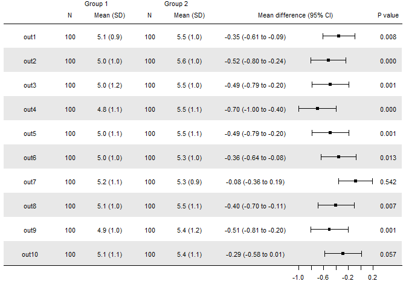

<!-- README.md is generated from README.Rmd. Please edit that file -->

# `forplot`

`forplot` allows the generation of highly customizable forest plots. It
relies on the [R](https://r-project.org) [graphics
package](http://127.0.0.1:28323/library/graphics/html/graphics-package.html)
and generates an overall layout that is then populated with the desired
elements (e.g. a text column or a specific plot).

## Installation

`forplot` can be installed from github:

``` r
#install package using remotes
remotes::install_github("dcr-unibe-ch/forplot")

# load package
library(forplot)
```

## Basic usage

`forplot` contains two main functions:

- `genfobj` generates a list of class **fobj** based on a data frame
  (*dat*) and a *layout*

- `plotfobj` produces the plot from the **fobj**

The **fobj** can be modified using a set of helper functions or by
directly changing the list. The individual elements are from the
[R](https://r-project.org) [graphics
package](http://127.0.0.1:28323/library/graphics/html/graphics-package.html)
and all options available there can be used.

The `forplotdata` dataset contains summary data with a 10 continuous
variables.

``` r
data(forplotdata)
```

Let’s generate a forest plot with the *forplotdata* including the label,
the descriptives, the formatted effect, the p-value, and a forest for
the beta. We pass the dataset to the `dat` argument. The layout argument
is used to define how each variable in the dataset should be handled in
the plot - `t` for text; `f` for forest (this requires 3 columns). The
`lwidths` argument is used to control the relative widths of each column
in the forest plot.

``` r
fobj <- genfobj(dat = forplotdata, 
                layout = c("t","t","t","t","t","t","f","t"), 
                lwidths = c(2,1,2,1,2,3,3,1)) |> 
  stripes() |> 
  gridlines() |> 
  header(headernr = 1, 
         hlayout = c(1,2,2,3,3,4,4,4),
         labels = c("", "Group 1", "Group 2", ""), y = .9) |> 
  header(headernr = 2, 
         hlayout = c(1,2,3,4,5,6,6,7),
         labels = c("", "N", "Mean (SD)", "N", "Mean (SD)", 
                    "Mean difference (95% CI)", "P value"), y = .4)
plotfobj(fobj)
```

<!-- -->
