# forplot

## `forplot`

An R package to generate highly customizable forest plots.

It relies on the [R](https://r-project.org) [graphics
package](http://127.0.0.1:28323/library/graphics/html/graphics-package.md)
and generates an overall layout that is then populated with the desired
elements (e.g. a text column or a specific plot).

### Usage

`forplot` contains two main functions:

- `genfobj` generates a list of class **fobj** based on a data frame
  (*dat*) and a *layout*

- `plotfobj` produces the plot from the **fobj**

The **fobj** can be modified using a set of helper functions or by
directly changing the list. The individual elements are from the
[R](https://r-project.org) [graphics
package](http://127.0.0.1:28323/library/graphics/html/graphics-package.md)
and all options available there can be used.

### Example data

The `forplot` package includes three data sets:

- *forplotdata*: summary data with a 10 continuous variables
- *forplotdata_prop*: summary data with 10 binary variables
- *forplotdata_bp*: data with actual observation of *forplotdata* in a
  long format

``` r

data(forplotdata)
forplotdata
#>    vlabel  n1        n2  n3        n4            beta_format        beta
#> 1    out1 100 5.1 (0.9) 100 5.5 (1.0) -0.35 (-0.61 to -0.09) -0.35330456
#> 2    out2 100 5.0 (1.0) 100 5.6 (1.0) -0.52 (-0.80 to -0.24) -0.52192832
#> 3    out3 100 5.0 (1.2) 100 5.5 (1.0) -0.49 (-0.79 to -0.20) -0.49461488
#> 4    out4 100 4.8 (1.1) 100 5.5 (1.1) -0.70 (-1.00 to -0.40) -0.69983471
#> 5    out5 100 5.0 (1.1) 100 5.5 (1.1) -0.49 (-0.79 to -0.20) -0.49398774
#> 6    out6 100 5.0 (1.0) 100 5.3 (1.0) -0.36 (-0.64 to -0.08) -0.35838850
#> 7    out7 100 5.2 (1.1) 100 5.3 (0.9)  -0.08 (-0.36 to 0.19) -0.08429217
#> 8    out8 100 5.1 (1.0) 100 5.5 (1.1) -0.40 (-0.70 to -0.11) -0.40311974
#> 9    out9 100 4.9 (1.0) 100 5.4 (1.2) -0.51 (-0.81 to -0.20) -0.50709366
#> 10  out10 100 5.1 (1.1) 100 5.4 (1.1)  -0.29 (-0.58 to 0.01) -0.28700316
#>      beta_lci     beta_uci    p1
#> 1  -0.6122615 -0.094347655 0.008
#> 2  -0.8044964 -0.239360217 0.000
#> 3  -0.7938491 -0.195380711 0.001
#> 4  -1.0035691 -0.396100319 0.000
#> 5  -0.7928756 -0.195099871 0.001
#> 6  -0.6395674 -0.077209590 0.013
#> 7  -0.3567376  0.188153237 0.542
#> 8  -0.6955442 -0.110695309 0.007
#> 9  -0.8110643 -0.203123036 0.001
#> 10 -0.5822050  0.008198722 0.057
```

``` r

data(forplotdata_prop)
forplotdata_prop
#>    vlabel  n1       n2  n3       n4 prop1 prop2            beta_format  beta
#> 1    out1 100 48 (48%) 100 40 (40%)  0.48  0.40   8.0% (-6.7 to 22.7%)  0.08
#> 2    out2 100 38 (38%) 100 37 (37%)  0.38  0.37  1.0% (-13.4 to 15.4%)  0.01
#> 3    out3 100 47 (47%) 100 47 (47%)  0.47  0.47  0.0% (-13.8 to 13.8%)  0.00
#> 4    out4 100 54 (54%) 100 41 (41%)  0.54  0.41  13.0% (-1.7 to 27.7%)  0.13
#> 5    out5 100 45 (45%) 100 40 (40%)  0.45  0.40   5.0% (-9.7 to 19.7%)  0.05
#> 6    out6 100 51 (51%) 100 38 (38%)  0.51  0.38  13.0% (-1.7 to 27.7%)  0.13
#> 7    out7 100 47 (47%) 100 36 (36%)  0.47  0.36  11.0% (-3.6 to 25.6%)  0.11
#> 8    out8 100 44 (44%) 100 46 (46%)  0.44  0.46 -2.0% (-16.8 to 12.8%) -0.02
#> 9    out9 100 53 (53%) 100 33 (33%)  0.53  0.33   20.0% (5.6 to 34.4%)  0.20
#> 10  out10 100 54 (54%) 100 38 (38%)  0.54  0.38   16.0% (1.4 to 30.6%)  0.16
#>       beta_lci  beta_uci    p1
#> 1  -0.06714147 0.2271415 0.319
#> 2  -0.13418240 0.1541824 1.000
#> 3  -0.13834069 0.1383407 1.000
#> 4  -0.01723947 0.2772395 0.089
#> 5  -0.09684704 0.1968470 0.567
#> 6  -0.01656604 0.2765660 0.088
#> 7  -0.03571955 0.2557195 0.151
#> 8  -0.16786783 0.1278678 0.887
#> 9   0.05560305 0.3443969 0.007
#> 10  0.01364509 0.3063549 0.033
```

``` r

data(forplotdata_bp)
head(forplotdata_bp)
#>      value variable arm
#> 1 4.373546     var1   1
#> 2 5.183643     var1   1
#> 3 4.164371     var1   1
#> 4 6.595281     var1   1
#> 5 5.329508     var1   1
#> 6 4.179532     var1   1
```

*forplotdata* and *forplotdata_prop* have a character variable with the
variable names (*vlabel*), further character variables *n\[1-4\]* with
the number of observations and descriptives for each arm (either mean
(sd) or n(%)), the formatted treatment effect (*beta_format*) and the
p-value (*p1*), and three numeric variables to draw the forest (*beta*,
*beta_lci* and *beta_uci*).

In *forplotdata_prop* there are two further numeric variables with the
proportion in each arm (*prop1*, *prop2*) to draw a strip plot.

*forplotdata_bp* has three variables with the actual observations of
*forplotdata* with

- *value*: the variable value (numerical),
- *variable*: the variable name (factor), and
- *arm*: the treatment arm (factor).

### Generating the **fobj** with `genfobj`

The required input for `genfobj` are a *layout* and a data frame
(*dat*).

*layout* must be a character vector with elements *t* (text), *f*
(forest), *s\[1-9\]* (strip), or *b* (boxplot).

For each *t* element, *dat* must contain a single variable, for each *f*
element three variables (point estimate, lower confidence limit, upper
confidence limit, in that order), and for each *s\[1-9\]* the number of
variables indicated in \[\].

The order of the variables in *dat* must correspond to the layout.

A *b* element does not need a column in *dat* but the specifcation of
*obs*, a data frame in a long format with columns *value* (the outcome
value), *variable* (the outcome variable), and *arm* (the treatment arm)

Let’s generate a forest plot with the *forplotdata* including the label,
the descriptives, the formatted effect, the p-value, and a forest for
the beta:

``` r

fobj<-genfobj(dat = forplotdata, layout = c("t","t","t","t","t","t","f","t"))
```

The produced **fobj** is a list of length 5 with class *fobj*. It
includes those elements:

- *dat* and *obs*: the data (with obs = NULL in this example)
- *setup*: overall composition of the plot, *layout*, *lheights*,
  *lwidths*, *y.at*, and *ylim*
- *items*: a list of length from *layout* with the options for each item
- *header*: a list with the options for the header

``` r

class(fobj)
#> [1] "fobj" "list"
names(fobj)
#> [1] "dat"    "obs"    "setup"  "items"  "header"
fobj$setup
#> $layout
#> [1] "t" "t" "t" "t" "t" "t" "f" "t"
#> 
#> $lmatrix
#>      [,1] [,2] [,3] [,4] [,5] [,6] [,7] [,8]
#> [1,]   10   10   10   10   10   10   10   10
#> [2,]    1    2    3    4    5    6    7    8
#> [3,]    9    9    9    9    9    9    9    9
#> 
#> $lwidths
#> [1] 1 1 1 1 1 1 1 1
#> 
#> $lheights
#> [1] 0.1 1.0 0.1
#> 
#> $y.at
#>  [1] 10  9  8  7  6  5  4  3  2  1
#> 
#> $ylim
#> [1]  0.5 10.5
length(fobj$items)
#> [1] 8
```

By default, text items include these options:

``` r

names(fobj$item[[1]])
#> [1] "type"  "vname" "plot"  "text"

fobj$item[[1]]
#> $type
#> [1] "t"
#> 
#> $vname
#> [1] "vlabel"
#> 
#> $plot
#> $plot$x
#> [1] 0
#> 
#> $plot$type
#> [1] "n"
#> 
#> $plot$xlim
#> [1] 0 1
#> 
#> $plot$ylim
#> [1]  0.5 10.5
#> 
#> $plot$yaxt
#> [1] "n"
#> 
#> $plot$ylab
#> [1] ""
#> 
#> $plot$xlab
#> [1] ""
#> 
#> $plot$axes
#> [1] FALSE
#> 
#> $plot$xaxs
#> [1] "i"
#> 
#> $plot$yaxs
#> [1] "i"
#> 
#> 
#> $text
#> $text$x
#> [1] 0.5
#> 
#> $text$y
#>  [1] 10  9  8  7  6  5  4  3  2  1
#> 
#> $text$labels
#>  [1] "out1"  "out2"  "out3"  "out4"  "out5"  "out6"  "out7"  "out8"  "out9" 
#> [10] "out10"
#> 
#> $text$adj
#> [1] 0.5 0.5
```

*type* is the item type, *vname* is the variable in *dat* the item
corresponds to, *plot* and *text* are used for plotting with the
[R](https://r-project.org) [graphics
package](http://127.0.0.1:28323/library/graphics/html/graphics-package.md).

The *f* items are more complex, including options for *axis*, *points*
and *arrows* of the fores plots.

``` r

names(fobj$items[[which(fobj$setup$layout=="f")]])
#> [1] "type"   "vname"  "plot"   "axis"   "points" "arrows"

fobj$items[[which(fobj$setup$layout=="f")]]$type
#> [1] "f"

fobj$items[[which(fobj$setup$layout=="f")]]$vname
#> [1] "beta"
```

For the variable name, the first of the three variables used to specify
the forest is used. Options for axis, point and arrows can be changed
using helper functions (or directly in the list). Examples or shown
below.

### Plot the **fobj**

The **fobj** can be plotted using `plotfobj`

``` r

plotfobj(fobj)
```


Column widths can be given as options in `genfobj` or directly changed
in the **fobj**:

``` r

fobj$setup$lwidths <- c(0.3,0.4,0.6,0.4,0.6,1,1,0.5)

plotfobj(fobj)
```


Horizontal gridlines and stripes can be added with helper functions
*gridlines* and *stripes*, which generate further elements in the fobj:

``` r

fobj<-gridlines(fobj)

fobj<-stripes(fobj)

names(fobj)
#> [1] "dat"       "obs"       "setup"     "items"     "header"    "gridlines"
#> [7] "stripes"
```

``` r

plotfobj(fobj)
```

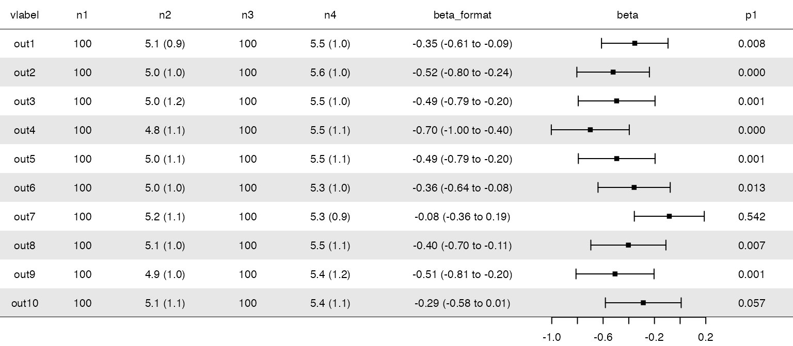

### Modify the items

All items, gridlines and stripes can be modified using helper functions
or by changing the **fobj** directly.

With helper function *t_options*, *t* items can be modified using all
options from R
[graphics::text()](https://stat.ethz.ch/R-manual/R-devel/library/graphics/html/text.html).
That can be done for a specific *t* item by using the number or column
name of the item, or for all *t* items (by keeping item=NULL):

``` r

fobj<-t_options(fobj = fobj, item = c("vlabel"), cex = 1.1, font = 2, col = "red", x=0.2, adj=0)

plotfobj(fobj)
```

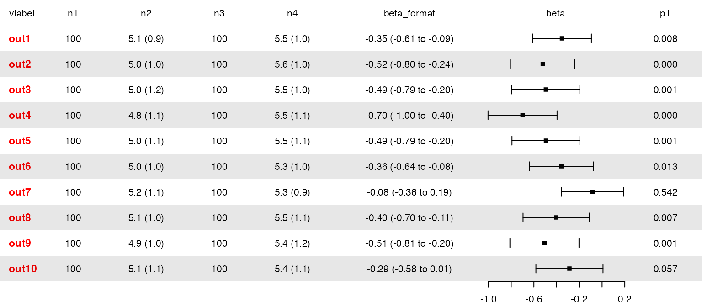

For *f* items there are several helper function to modify the options
for the different elements: *f_axis*, *f_points*, *f_arrows*. Also here,
all options from
[graphics::axis()](https://stat.ethz.ch/R-manual/R-devel/library/graphics/html/axis.html),
[graphics::points()](https://stat.ethz.ch/R-manual/R-devel/library/graphics/html/points.html)
and
[graphics::arrows()](https://stat.ethz.ch/R-manual/R-devel/library/graphics/html/arrows.html)
can be used. As we do only have one forest item, we do not have to
specify the *item*.

``` r

fobj<-f_axis(fobj = fobj, xlim = c(-1.1,0.2), at = c(-1,-0.6,-0.2,0.2), 
  tck = -0.03, mgp = c(2,0.5,0))

fobj<-f_points(fobj = fobj, pch = 16, cex = 1.5)

plotfobj(fobj)
```

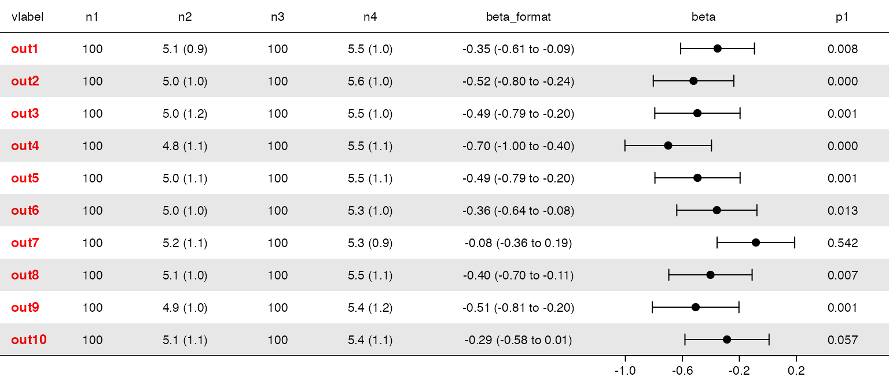

With *f_refline*, reference line(s) can be added and with *f_direction*
a label for the direction below the axis. Note that the footer height
has to be increased to fit the direction label.

``` r

fobj<-f_refline(fobj, v = 0)

fobj<-f_direction(fobj, text = "A better    B better", line = 1.6)

fobj$setup$lheights[3]<-0.15

plotfobj(fobj)
```


To remove an added item, it can be set to NULL (or a new **fobj** could
be generated):

``` r

fobj$items[[which(fobj$setup$layout=="f")]]$refline<-NULL

plotfobj(fobj)
```

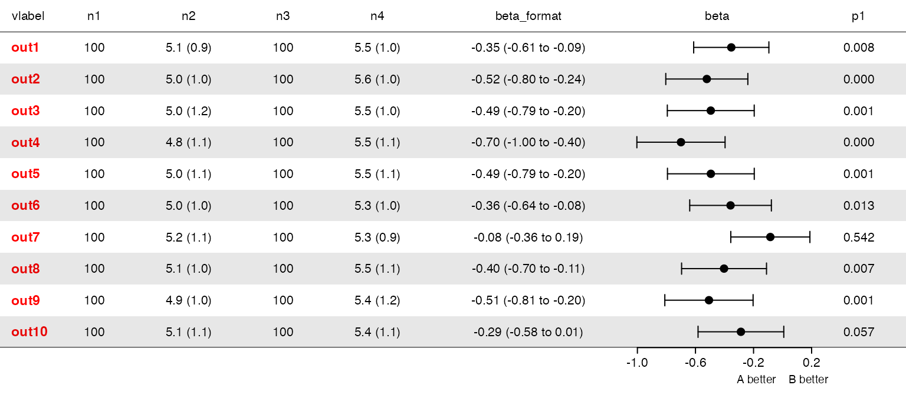

#### Piping

The modifying elements can be piped. For example to reproduce the
**fobj** from above:

``` r


genfobj(dat = forplotdata,
  layout = c("t","t","t","t","t","t","f","t"),
  lwidth = c(0.3,0.4,0.6,0.4,0.6,1,1,0.5),
  lheight = c(0.1,1,0.15)) |>
  gridlines() |>
  stripes() |>
  t_options(item = c("vlabel"), cex = 1.1, font = 2, col = "red", x=0.2, adj=0) |>
  f_axis(xlim=c(-1.1,0.2), at = c(-1,-0.6,-0.2,0.2), tck = -0.03, mgp = c(2,0.5,0)) |>
  f_points(pch = 16, cex = 1.5) |>
  f_refline(v = 0) |>
  f_direction(text = "A better    B better", line = 1.6) |>
  plotfobj()
```

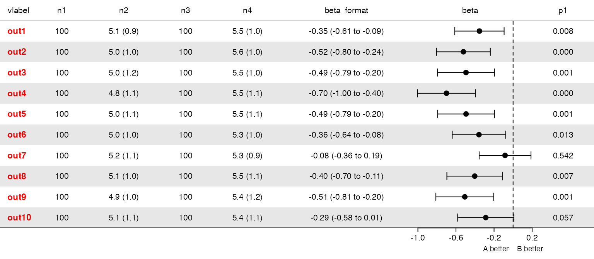

#### Arrowheads

When using *xlim* via *f_axis*, x-axis limits that are narrower then the
confidence limits can be set (even though that is usually not
recommended). The cap at the end of the confidence interval is then not
plotted (as it is outside of the plotting region). However, directional
arrowheads can help to make the distinction more prominent. Arrowheads
can be modified via function *f_arrows* but it is not completely
straightforward because arrows have to be drawn twice to have different
heads on both sides (e.g. with code 1 and 2 and angles 30 and 90). The
helper function *f_cutarrows* does that automatically:

``` r

# Modify data to generate some very wide limits:
dat<-forplotdata
dat$beta_lci[1]<-c(-3)
dat$beta_uci[2]<-c(3)
dat[3,c("beta_lci","beta_uci")]<-c(-3,3)
dat[4,c("beta","beta_lci")]<-c(-2,-3)
dat$beta_format<-paste0(sprintf("%2.2f",dat$beta),
  " (",sprintf("%2.2f",dat$beta_lci)," to ",
  sprintf("%2.2f",dat$beta_uci),")")

# Generate and plot fobj:
genfobj(layout = c("t","t","t","t","t","t","f","t"),
    dat = dat, lwidths = c(0.8,0.4,0.6,0.4,0.6,1,1,0.5)) |>
  f_axis(xlim=c(-1.5,1)) |>
  f_cutarrows() |>
  plotfobj()
```


### The header

By default a header with the columns names is used and stored in the
*header* element of **fobj**, which is a list of length 1 with these
elements.

``` r

fobj$header
#> [[1]]
#> [[1]]$hlayout
#> [1] 1 2 3 4 5 6 7 8
#> 
#> [[1]]$text
#> [[1]]$text$x
#> NULL
#> 
#> [[1]]$text$y
#> [1] 0.5
#> 
#> [[1]]$text$labels
#> [1] "vlabel"      "n1"          "n2"          "n3"          "n4"         
#> [6] "beta_format" "beta"        "p1"         
#> 
#> [[1]]$text$adj
#> [1] 0.5 0.5
```

The *header* helper function can be used with all options from
[graphics::text()](https://stat.ethz.ch/R-manual/R-devel/library/graphics/html/text.html)
As an extra element, the *hlayout* can be used to merge columns, i.e. to
print a label over more than one column. And more than one header row
can be specified using *headernr*, leading to a list of length \> 1.

Let’s first use different names, also including a line separator. Note
that an empty character has to be included to leave column 1 and 8
empty. And the y is also modified to place the label higher.

``` r

fobj<-header(fobj = fobj,
  labels = c("","Arm A\nN","Arm A\nmean (sd)","Arm B\nN","Arm B\nmean (sd)",
    "Mean difference\n(95% CI)","","P-value"),
  y = 0.6)

plotfobj(fobj)
```

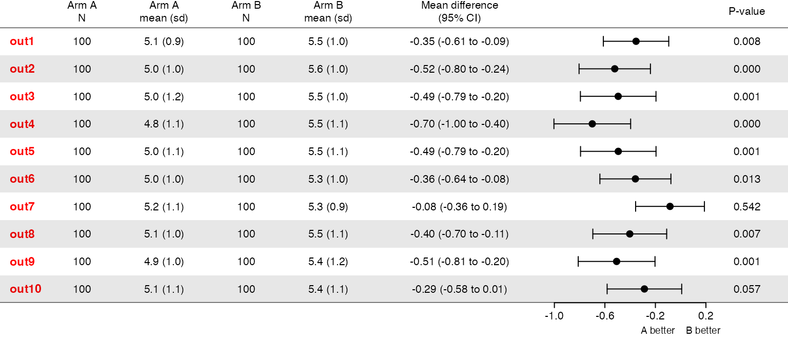

We can merge the label for the effect over the format and forest columns
using the layout option where 6 is included twice.

``` r

fobj<-header(fobj = fobj, hlayout = c(1,2,3,4,5,6,6,7),
  labels = c("","Arm A\nN","Arm A\nmean (sd)","Arm B\nN","Arm B\nmean (sd)",
    "Mean difference (95% CI)","P-value"))

plotfobj(fobj)
```

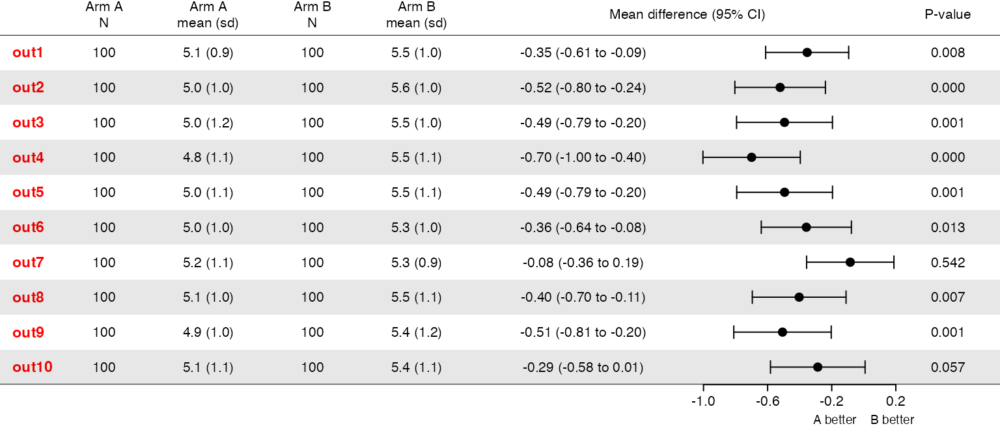

In order to merge two arm labels, we would need two header rows using
option *headernr*, leading to a header list with length 2. As before we
can use further
[graphics::text()](https://stat.ethz.ch/R-manual/R-devel/library/graphics/html/text.html)
options.

``` r

fobj<-header(fobj=fobj, hlayout = c(1,2,2,3,3,4,4,5),  headernr = 1,
    labels=c("","Arm A","Arm B","Mean difference (95% CI)","P-value"),
    y=0.9)

fobj<-header(fobj=fobj, hlayout = c(1,2,3,4,5,6,7,8), headernr = 2,
    labels=c("","N","Mean (sd)","N","Mean (sd)","","",""),y=0.3)

plotfobj(fobj)
```

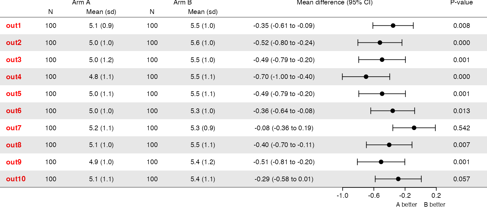

### Boxplots

For a more in-depth presentation of the data in each group, a boxplot
can be added. However, it depends on the input of the actual
observations as a data frame *obs* in a long format with the numerical
outcome value (*value*), the variable name (*variable*, as a factor) and
the treatment arm (*arm*, as a factor).

Note that the names of *variable* do not have to be the same as in the
summary data (*dat*) but the order has to be kept (i.e. the first level
of *variable* must correspond the first row in *dat*).

Boxplot layout can be controlled via helper functions *b_boxplot* and
*b_axis* using all options available for
[graphics::boxplot()](https://stat.ethz.ch/R-manual/R-devel/library/graphics/html/boxplot.html)
and
[graphics::axis()](https://stat.ethz.ch/R-manual/R-devel/library/graphics/html/axis.html).

``` r

fobj<-genfobj(dat = forplotdata, obs = forplotdata_bp,
  layout = c("t","t","t","t","t","b","t","f","t"),
  lwidths = c(0.6,0.4,0.6,0.4,0.6,1,1,1,0.5))

plotfobj(fobj)
```


Adding header gridlines and stripes:

``` r

fobj<-gridlines(fobj)

fobj<-stripes(fobj)

fobj<-header(fobj, hlayout = c(1,2,2,3,3,4,5,5,6),  headernr = 1,
    labels=c("","Arm A","Arm B","","Mean difference (95% CI)","P-value"),
    col = c(1,"red","blue",1,1),
    y=0.9)
fobj<-header(fobj, hlayout = c(1,2,3,4,5,6,7,8,9), headernr = 2,
    labels=c("","N","Mean (sd)","N","Mean (sd)","","","",""),
    col=1, y=0.3)

plotfobj(fobj)
```

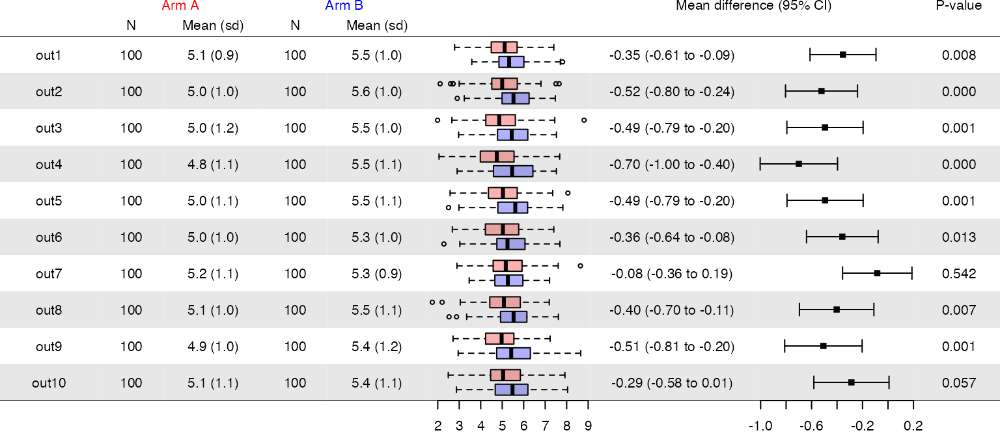

### Density plots

Density plots can be specified using layout item *d* and depend on the
same data with the observations as the boxplots.

``` r

fobj<-genfobj(dat = forplotdata, obs = forplotdata_bp,
  layout = c("t","t","t","t","t","b","d","t","f","t"),
  lwidths = c(0.3,0.4,0.6,0.4,0.6,1,1,1,1,0.5))
 
fobj<-b_axis(fobj, xlim=c(0,9.5))

fobj<-gridlines(fobj)

fobj<-stripes(fobj)

fobj<-header(fobj, hlayout = c(1,2,2,3,3,4,5,6,6,7),  headernr = 1,
    labels=c("","Arm A","Arm B","","","Mean difference (95% CI)","P-value"),
    col = c(1,"red","blue",1,1,1),
    y=0.9)
fobj<-header(fobj, hlayout = c(1,2,3,4,5,6,7,8,9,10), headernr = 2,
    labels=c("","N","Mean (sd)","N","Mean (sd)","","","","",""),
    col=1, y=0.3)

plotfobj(fobj)
```

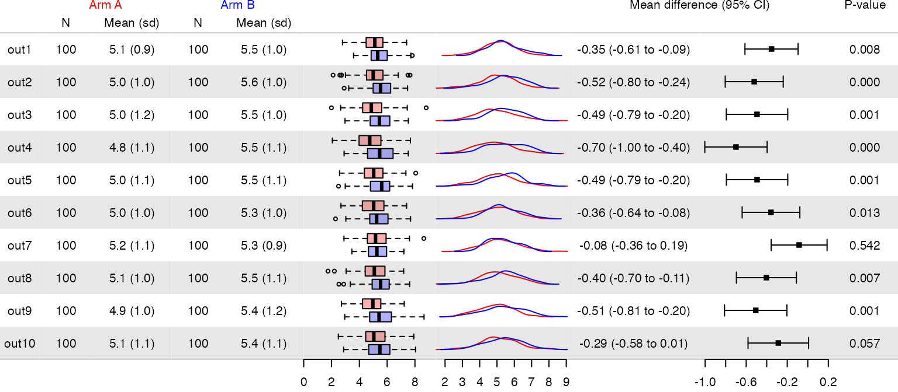

Options can be change via *d_axis* and *d_lines* using all options
available for
[graphics::axis()](https://stat.ethz.ch/R-manual/R-devel/library/graphics/html/axis.html)
and
[graphics::lines()](https://stat.ethz.ch/R-manual/R-devel/library/graphics/html/lines.html).

Note that the *lines* element of the *d* items is a nested list with
*variable* and *arm*. Using *d_lines*, line options can be accessed all
at once, over all variables for one arm, for all arms and one variable,
or for a specific variable-arm combination via *linenr*. *linenr* is a
vector of length two where the first element specifies the variable and
the second the arm.

``` r

fobj<-genfobj(dat = forplotdata, obs = forplotdata_bp,
  layout = c("t","t","t","t","t","d","t","f","t"),
  lwidths = c(0.3,0.4,0.6,0.4,0.6,1,1,1,0.5))

#all lines:

fobj<-d_lines(fobj=fobj, lw=1.5)
plotfobj(fobj)
```

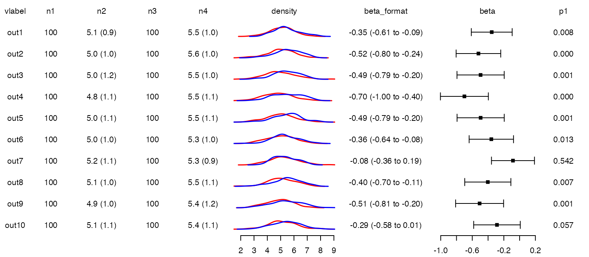

``` r

#only one arm:

fobj<-d_lines(fobj=fobj, linenr=c(NA,2), col=1)
plotfobj(fobj)
```

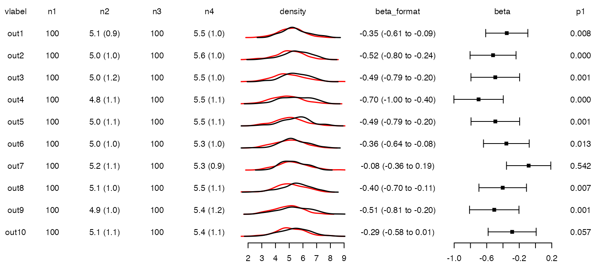

Different density curves could be added by using *x* and *y* options in
*d_lines* (or the *lines* list in the **fobj**). Note that the
y-position has to be shifted by *y.at* for each variable.

### Strip plot for proportions

For binary outcomes and in particular for serious adverse event
reporting a graphical representation of the proportion in both arms has
been recommended.

A strip plot for the proportions can be added via *s\[1-9\]*, where the
number would indicate the number of points in the strip plot and the
number of columns in the *dat* (usually two if there are two treatment
arms). The “s” items then contains several *points* elements.

For example:

``` r

fobj<-genfobj(dat = forplotdata_prop,
  layout = c("t","t","t","t","t","s2","t","f","t"),
  lwidths = c(0.3,0.4,0.6,0.4,0.6,1.0,1.2,1,0.5))

plotfobj(fobj)
```


Options can be modified via *s_axis*, *s_hline* and *s_points* using all
options available for using all options available for
[graphics::axis()](https://stat.ethz.ch/R-manual/R-devel/library/graphics/html/axis.html),
[graphics::abline()](https://stat.ethz.ch/R-manual/R-devel/library/graphics/html/abline.html)
and
[graphics::points()](https://stat.ethz.ch/R-manual/R-devel/library/graphics/html/points.html).

Note that for points, each sub-item has can be specified separately
using *pointnr* (e.g. to specify colors).

Left and right borders can be added via *s_borders*.

``` r

fobj<-s_axis(fobj=fobj, xlim = c(0,1), 
  at = seq(0,1,by=0.25), labels = seq(0,100,by=25))

fobj<-s_points(fobj=fobj, pch = 16, cex=1.5)

fobj<-s_points(fobj=fobj, pointnr = 1, col = "red")

fobj<-s_points(fobj=fobj, pointnr = 2, col = "blue")

fobj<-s_borders(fobj)

fobj<-gridlines(fobj)

plotfobj(fobj)
```


### Combine fobjs

A list of **fobj** can be combined using `combinefobj` resulting in an
object of class **cfobj**, which includes an overall *setup*, an overall
*header* and the list of the individual **fobj**.

The layout is adapted automatically. If there are different number of
columns, they are distributed using a grid with the least common
multiple. If the *lwdiths* vary, the average is taken.

``` r

#prepare first fobj
fobj1<-genfobj(dat = forplotdata, obs = forplotdata_bp,
  layout = c("t","t","t","t","t","b","t","f","t"),
  lwidths = c(0.3,0.4,0.6,0.4,0.6,1,1,1,0.5))

fobj1$setup$lheights[1]<-0.2
fobj1$setup$lheights[3]<-0.2

fobj1<-gridlines(fobj = fobj1)
fobj1<-stripes(fobj = fobj1)

fobj1<-header(fobj = fobj1, hlayout = c(1), headernr = 1,
    labels=c("Continuous variables"),
    col = 1, y = 0.9, font = 2, cex=1.2)

fobj1<-header(fobj = fobj1, hlayout = c(1,2,2,3,3,4,5,5,6),  headernr = 2,
    labels=c("","Arm A","Arm B","","Mean difference (95% CI)","P-value"),
    col = c(1,"red","blue",1,1), y = 0.45, font = 1, cex = 1)

fobj1<-header(fobj = fobj1, hlayout = c(1,2,3,4,5,6,7,8,9), headernr = 3,
    labels=c("","N","Mean (sd)","N","Mean (sd)","","","",""),
    col = 1, y = 0.15, font = 1, cex = 1)


#prepare second fobj
fobj2<-genfobj(dat = forplotdata_prop,
  layout = c("t","t","t","t","t","s2","t","f","t"),
  lwidths = c(0.3,0.4,0.6,0.4,0.6,1,1,1,0.5))

fobj2$setup$lheights[1]<-0.2
fobj2$setup$lheights[3]<-0.2

fobj2<-s_axis(fobj = fobj2, xlim = c(0,1), 
  at = seq(0,1,by=0.25), labels = seq(0,100,by=25))

fobj2<-s_borders(fobj = fobj2)

fobj2<-gridlines(fobj = fobj2)
fobj2<-stripes(fobj = fobj2)

fobj2<-header(fobj = fobj2, hlayout = c(1), headernr = 1,
    labels=c("Binary variables"),
    col = 1, y = 0.9, font = 2, cex=1.2)

fobj2<-header(fobj = fobj2, hlayout = c(1,2,2,3,3,4,5,5,6),  headernr = 2,
    labels=c("","Arm A","Arm B","Proportion (%)","Odds ratio (95% CI)","P-value"),
    col = c(1,"red","blue",1,1), y = 0.45, font = 1, cex = 1)

fobj2<-header(fobj = fobj2, hlayout = c(1,2,3,4,5,6,7,8,9), headernr = 3,
    labels=c("","N","n (%)","N","n (%)","","","",""),
    col = 1, y = 0.15, font = 1, cex = 1)

#combine:
cfobj<-combinefobj(list(fobj1, fobj2))

names(cfobj)
#> [1] "setup"  "header" "fobjs"
cfobj$setup
#> $lmatrix
#>      [,1] [,2] [,3] [,4] [,5] [,6] [,7] [,8] [,9]
#> [1,]    1    1    1    1    1    1    1    1    1
#> [2,]   12   12   12   12   12   12   12   12   12
#> [3,]    2    3    4    5    6    7    8    9   10
#> [4,]   11   11   11   11   11   11   11   11   11
#> [5,]   23   23   23   23   23   23   23   23   23
#> [6,]   13   14   15   16   17   18   19   20   21
#> [7,]   22   22   22   22   22   22   22   22   22
#> [8,]   24   24   24   24   24   24   24   24   24
#> 
#> $lwidths
#> [1] 0.05172414 0.06896552 0.10344828 0.06896552 0.10344828 0.17241379 0.17241379
#> [8] 0.17241379 0.08620690
#> 
#> $lheights
#> [1] 0.200 0.200 1.000 0.200 0.200 1.000 0.200 0.028
#> 
#> $iheadfoot
#> [1] TRUE TRUE
```

The **cfobj** can be plotted using the same plot function:

``` r

#plot list:
plotfobj(fobj = cfobj)
```

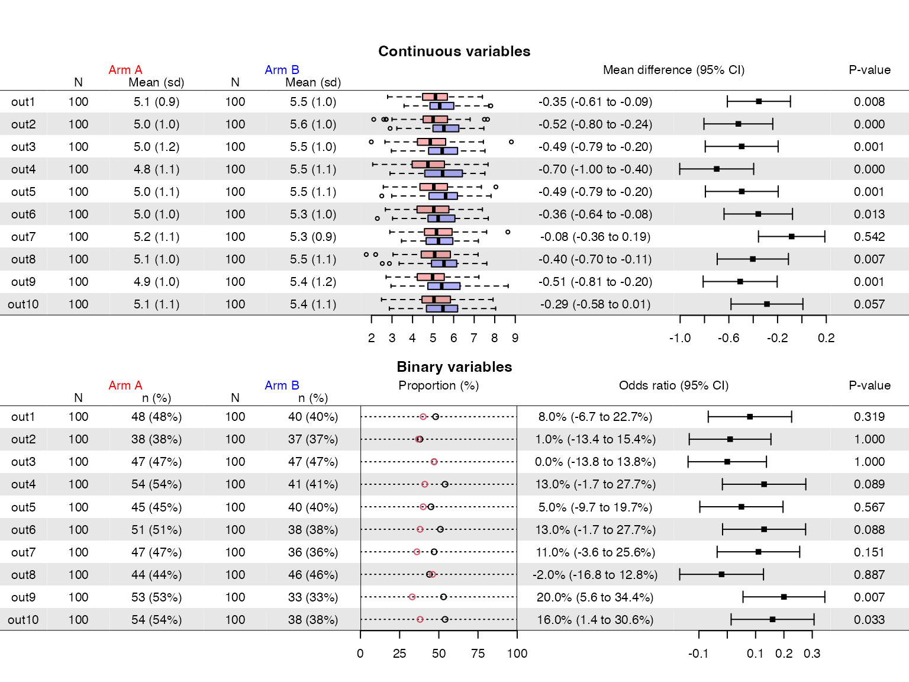

Combining plots can also be used to get different scaling for the plots
of the individual variables. Assume we would like to present a number of
differently scaled continuous variables with boxplots and densities.
Note that we removed the headers of the indiviual fobj but kept the
footer (to have space for the axes) by setting *ikeepheadfoot* to
c(FALSE, TRUE).

``` r

set.seed(1)

fobj<-vector(10,mode="list")

for (i in 1:length(fobj)) {
  
  #modify the data
    obs<-forplotdata_bp[forplotdata_bp$variable==paste0("var",i),]
    obs$value<-obs$value + runif(1,-10,10)
    obs$variable<-factor(obs$variable)
    
    dat<-cbind(forplotdata[i,1:5],"")
    dat$n2<-paste0(sprintf("%1.1f",mean(obs$value[obs$arm==1]))," (",
    sprintf("%1.1f",sd(obs$value[obs$arm==1])),")")
    dat$n4<-paste0(sprintf("%1.1f",mean(obs$value[obs$arm==2]))," (",
    sprintf("%1.1f",sd(obs$value[obs$arm==1])),")")
    
    #generate individual fplots
    fobji<-genfobj(dat = dat, obs = obs,
        layout = c("t","t","t","t","t","b","t","d"), 
        lwidths = c(0.3,0.4,0.6,0.4,0.6,1,0.1,1),
        lheights = c(0.2,1,0.25))
    
    fobji<-b_axis(fobji, cex.axis=0.8, mgp=c(0,0.3,0), tck=-0.1)
    fobji<-d_axis(fobji, cex.axis=0.8, mgp=c(0,0.3,0), tck=-0.1)
    
    #remove individual headers
    #fobji$header<-NULL
    
    #gridlines on first and last fobj
    if (i==1) {
        fobji<-gridlines(fobji, h=fobji$setup$ylim[2])
    }
    if (i==length(fobj)) {
      fobji<-gridlines(fobji, h=fobji$setup$ylim[1])
    }
    
    #collect
    fobj[[i]]<-fobji
    
}
cfobj<-combinefobj(fobj)

#combine and add overall header
cfobj<-combinefobj(fobj, keepiheadfoot = c(FALSE, TRUE)) |>
  header(hlayout = c(1,2,2,3,3,4,5,6), headernr = 1,
        labels=c("","Arm A","Arm B","Boxplot","","Density"),
        col = c(1,"red","blue",1,1), y = 0.9) |>
  header(hlayout = c(1,2,3,4,5,6,7,8), headernr = 2,
            labels=c("","N","mean (sd)","N","mean (sd)","","",""),
            col = 1, y = 0.35)
        
#adapt overall header and footer
cfobj$setup$lheights[1]<-1
cfobj$setup$lheights[length(cfobj$setup$lheights)]<-0.5

#combine and plot the list of fobj
plotfobj(cfobj)
```

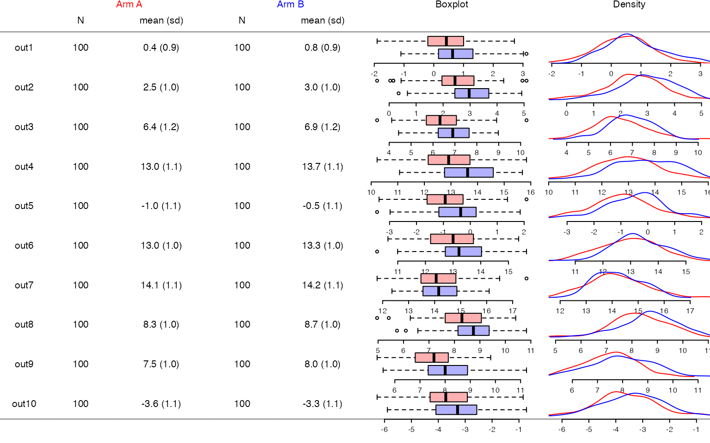

### Inserting subtitles

Subtitles can be inserted using the `combinefobj` functionality with an
**fobj** that does only have one column. The function `insert_subtitle`
helps with the preparation:

``` r

fobj<-genfobj(dat = forplotdata,
  layout = c("t","t","t","t","t","t","f","t"), 
    lwidths = c(0.3,0.4,0.6,0.4,0.6,1,1,0.5))

cfobj<-insert_subtitle(fobj,
    atrows=c(1, 3, 5),
    subtitle=c("A first long title is added here",
        "A second long title is added here",
        "A third long title is added here")
)

plotfobj(cfobj)
```


The resulting **cfobj** contains 6 individual **fobj** (for each
subtitle and the parts in between), which can be modified individually.
We can e.g. modify subtitles or remove the axes in the first and second
part of the plot.

Note that there are no individual headers and footers for this 6
**fobj**, which is the case if they are combined directly via
`combinefobj` (unless option *keepiheadfoot* is set to FALSE).

The overall header can be accessed via the `header` function in the same
way as for an individual `fobj`.

``` r

#change text and background color, add gridlines
cfobj$fobjs[[1]]<-t_options(cfobj$fobjs[[1]], col = "red")
for (i in c(1,3,5)) {
  cfobj$fobjs[[i]]<-cfobj$fobjs[[i]] |>
      stripes() |>
      gridlines()
}

#only keep bottom axis
cfobj$fobjs[[2]]$items[[7]]$axis<-NULL
cfobj$fobjs[[4]]$items[[7]]$axis<-NULL
#add gridline at the bottom
cfobj$fobjs[[6]]<-gridlines(cfobj$fobjs[[6]])

#overall header
cfobj<-cfobj |>
    header(hlayout = c(1,2,2,3,3,4,4,5),  headernr = 1,
        labels=c("","Arm A","Arm B","Mean diff (95% CI)","P-value"),
        y=0.9) |>
    header(hlayout = c(1,2,3,4,5,6,7,8), headernr = 2,
        labels=c("","N","Mean (sd)","N","Mean (sd)","","",""),y=0.3) 
    
#adapt height of header and footer
cfobj$setup$lheights[1]<-0.15
cfobj$setup$lheights[length(cfobj$setup$lheights)]<-0.15

plotfobj(cfobj)
```


